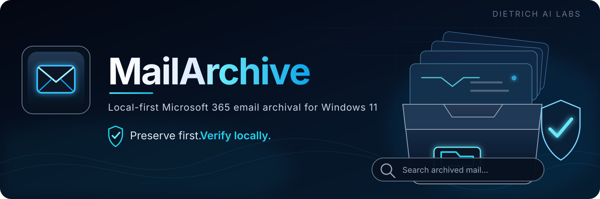

<p align="center">
  
</p>

<div align="center">
  

# MailArchive 1.0.0-rc6

**Local-first Microsoft 365 email archival for Windows 11.**  
Preserve the original message. Verify it locally. Keep control of the archive.

<p>
  <a href="https://github.com/dietrichailabs-oss/MailArchive/releases/tag/v1.0.0-rc6"></a>
  
  
  
  
</p>

<p>
  <a href="https://github.com/dietrichailabs-oss/MailArchive/releases/download/v1.0.0-rc6/MailArchive_1.0.0-rc6_Windows11_x64_Public.zip"><strong>⬇ Download MailArchive for Windows 11</strong></a>
  &nbsp;&nbsp;•&nbsp;&nbsp;
  <a href="https://github.com/dietrichailabs-oss/MailArchive/releases/tag/v1.0.0-rc6"><strong>Release Notes</strong></a>
  &nbsp;&nbsp;•&nbsp;&nbsp;
  <a href="https://www.dietrichailabs.com/mailarchive.html"><strong>Product Page</strong></a>
</p>
</div>

---

> [!IMPORTANT]
> **Preserve first. Verify locally. Only then optionally move still-verified originals to Deleted Items.**  
> MailArchive Version 1 has **no permanent-delete path** and never automatically empties Microsoft 365 Deleted Items.

## What MailArchive does

MailArchive gives ordinary Microsoft 365 users a straightforward way to preserve mailbox content into a local archive they control. Choose the folders and date range, preview the job, archive the original `.eml` messages and attachments, verify the preserved data, then search and read the archive offline.

<table>
  <tr>
    <td width="25%" align="center"><strong>📥 Preserve originals</strong><br><br>Stores original <code>.eml</code> messages and attachments instead of reducing mail to a simplified export.</td>
    <td width="25%" align="center"><strong>🛡️ Verify locally</strong><br><br>Integrity checks bind archived content to its local database and manifest before cleanup eligibility.</td>
    <td width="25%" align="center"><strong>🔎 Search offline</strong><br><br>Search and open archived messages locally without requiring an active Microsoft 365 connection.</td>
    <td width="25%" align="center"><strong>📦 Move the archive</strong><br><br>Reopen a preserved archive after moving it to another folder, drive, or approved storage location.</td>
  </tr>
</table>

## Highlights

- **Microsoft 365 sign-in** using a public desktop-client authentication flow.
- **Full folder selection** with visible nested folders, Select All, Clear All, and persistent choices.
- **U.S. date workflow** with `MM/DD/YYYY` entry and a native local calendar picker.
- **Preview before archive** so the selected mailbox scope, dates, and destination are visible first.
- **Original-message preservation** using `.eml` plus extracted attachments.
- **Local integrity verification** before a message can become eligible for optional cleanup.
- **Searchable offline viewer** for archived mail, attachments, raw headers, and original `.eml` access.
- **Hardened HTML viewing** with remote-content blocking, restrictive CSP, controlled inline resources, sanitization, and integrity checks on served content.
- **Cancel-safe and resumable jobs** for longer archive operations.
- **Persistent Back navigation** while signed in; authentication is cleared only by explicit Sign Out.
- **Movable/reopenable archives** with local integrity preserved across the move workflow.
- **Verified-only cleanup** that can move still-verified online originals to Microsoft 365 Deleted Items after explicit confirmation.

## How it works

1. **Sign in** to Microsoft 365.
2. **Choose mailbox folders** — one, several, nested folders, or Select All.
3. **Choose a date range** and local archive destination.
4. **Preview and archive** the selected messages.
5. **Verify locally** that the preserved MIME, hashes, manifest, database state, attachments, and message identity are intact.
6. **Search/read offline** — and, only if you choose cleanup, move still-verified originals to Deleted Items.

The cleanup step is intentionally downstream of preservation and verification. A message that does not satisfy the verification requirements is not eligible for mailbox modification.

## Safety model

MailArchive was built around one release property:

> **An online message must never be removed from its current mailbox location unless its local archive copy has already been successfully preserved and independently verified.**

For Version 1:

- cleanup is optional;
- cleanup requires explicit user confirmation;
- only **VERIFIED** archived messages are eligible;
- current local integrity and provider identity are rechecked before movement;
- eligible messages are moved to **Deleted Items only**;
- MailArchive contains no permanent-delete operation;
- MailArchive does not automatically empty Deleted Items.

Moving a message to Deleted Items does not guarantee quota recovery and does not override Microsoft 365 retention, legal-hold, or organization policies.

## Offline archive viewer

The local viewer is designed for reading archived mail without turning saved HTML email into an unrestricted web page.

- binds to loopback only;
- blocks remote message resources;
- uses a restrictive Content Security Policy;
- removes scripts, frames, forms, unsafe URL schemes, event handlers, and dangerous HTML containers;
- permits controlled local inline-image resources only through the archive viewer;
- forces normal attachments to download rather than execute inline;
- rechecks local integrity before serving original MIME, attachments, and archive resources;
- provides explicit raw-header and original `.eml` access.

RC6 also includes hardened MIME fallback behavior for difficult real-world email HTML, including structural-only and Unicode default-ignorable content that would otherwise appear visually blank.

## Download & verify

**Current public release candidate:** `MailArchive 1.0.0-rc6`  
**Platform:** Windows 11 x64

| Artifact | Size | SHA-256 |
|---|---:|---|
| `MailArchive_1.0.0-rc6_Windows11_x64_Public.zip` | 30,413,303 bytes | `B9F9A2A6C244D30CA51CF344AE23F888A35F8318A26034FE5B6EDCECD0017D19` |
| Signed `MailArchive_1.0.0-rc6_Setup.exe` | 30,920,408 bytes | `18FE314C5C2F20937E656E5214611DFF3EF3A3D1C86DAF91630B5D7E3B162690` |

### [⬇ Download the exact RC6 public package](https://github.com/dietrichailabs-oss/MailArchive/releases/download/v1.0.0-rc6/MailArchive_1.0.0-rc6_Windows11_x64_Public.zip)

The release ZIP includes its own `SHA256_CHECKSUMS.txt`, first-party license, public signing certificate, README, and signed installer.

## Requirements

| Requirement | Details |
|---|---|
| Operating system | **Windows 11 x64** |
| Mailbox | Microsoft 365 account for live archival |
| Storage | Local folder, internal drive, external drive, or approved local/network-backed location with sufficient capacity |
| Offline reading | Microsoft 365 is not required once the mail is already preserved locally |

Windows 10 is **not** an advertised Version 1 release target.

## Signing & Windows trust

The installer carries an Authenticode signature using the established Dietrich AI Labs self-signed certificate:

```text
Subject: CN=Dietrich AI Labs
SHA-1 thumbprint: C7FB96DDE901E3D57637804A63AC11FDDE0B5D32
Public certificate SHA-256: B067E75AFCB37F986F461FE2E341DC3F5C1AFC4AF8D16C44E9B0A1FA5B33C81F
```

The certificate is included publicly so organizations can inspect it under their own trust/allowlisting policies. The private signing key is **not** distributed.

> [!NOTE]
> The certificate is self-signed, so Windows SmartScreen or trust dialogs may still show **Unknown publisher** or reputation warnings on machines that do not trust the certificate. The signature establishes cryptographic integrity; it does **not** claim Microsoft Verified Publisher or Entra Publisher Verification.

## Privacy & Microsoft 365 access

MailArchive is local-first. The archive itself stays at the destination you choose.

- archive access uses delegated `Mail.Read`;
- cleanup requests `Mail.ReadWrite` only when the cleanup capability is used;
- no Send Mail permission is required;
- no calendar, contacts, files, or tenant-wide mailbox-administration permission is required for Version 1;
- the application has no provider permanent-delete operation;
- authentication tokens are protected with Windows DPAPI rather than a plaintext fallback;
- bearer/access/refresh tokens are redacted from application logging paths.

For sensitive corporate archives, use normal endpoint controls such as BitLocker or other approved encrypted storage and appropriate file-system permissions.

## Release validation

The exact RC6 product candidate and the final signed public package completed independent release QA before publication. Validation covered the complete viewer-security matrix, archive-safety invariants, package integrity, signed-byte reconstruction, fresh installation, runtime/viewer smoke, repair/reinstall, a true prior-release upgrade path, moved archives, uninstall, and archive survival.

The final public package above is the immutable QA-approved release identity. Rebuilding, recompressing, re-signing, or otherwise changing it creates a different binary identity.

## Source snapshot & license

This public repository contains the source snapshot corresponding to the released MailArchive `1.0.0-rc6` product line. See [`SOURCE_IDENTITY.json`](SOURCE_IDENTITY.json) for the preserved source identity.

MailArchive is **proprietary freeware**, not open-source software.

- License: `LicenseRef-Dietrich-AI-Labs-Freeware-1.0`
- Full terms: [`LICENSE.txt`](LICENSE.txt)
- Publisher: **Dietrich AI Labs**

## Official links

- 🌐 [Dietrich AI Labs](https://www.dietrichailabs.com/)
- 📦 [MailArchive product page](https://www.dietrichailabs.com/mailarchive.html)
- ⬇ [Download center](https://www.dietrichailabs.com/downloads.html)
- 📝 [MailArchive release notes](https://github.com/dietrichailabs-oss/MailArchive/releases/tag/v1.0.0-rc6)
- 🐛 [GitHub Issues](https://github.com/dietrichailabs-oss/MailArchive/issues)
- ✉️ [Support](https://www.dietrichailabs.com/contact.html)

---

<p align="center">
  <strong>Dietrich AI Labs</strong><br>
  Local-first tools built around user control, verifiable artifacts, and practical Windows workflows.
</p>
